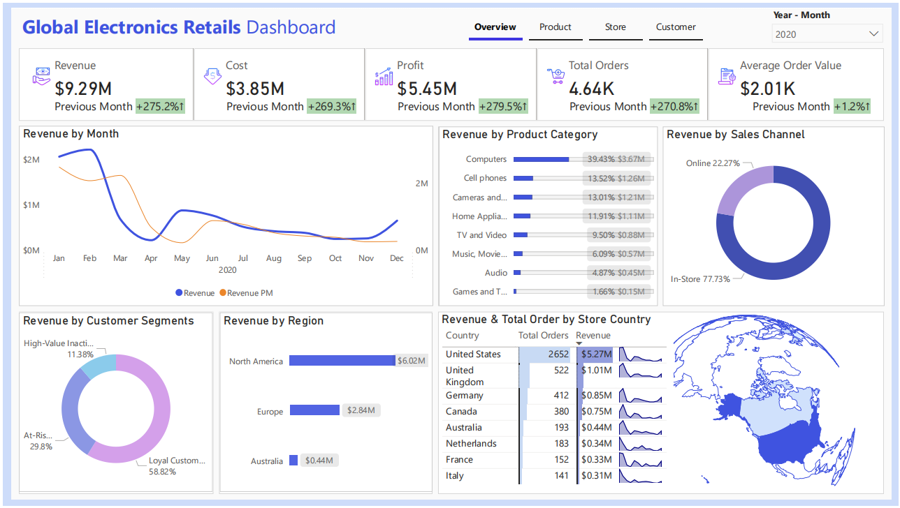
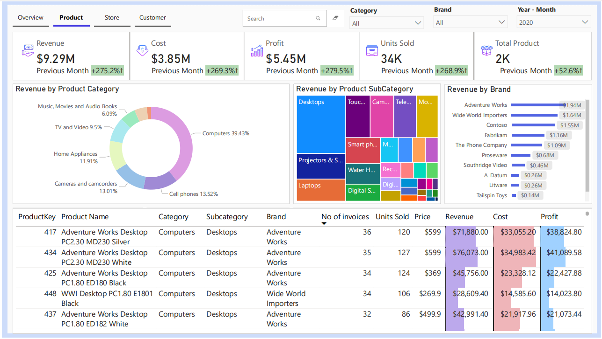
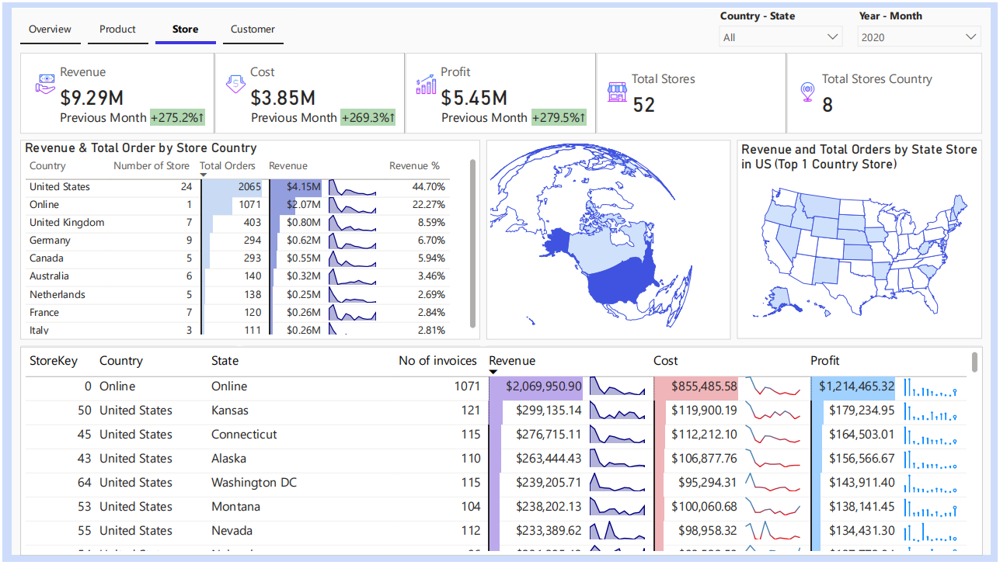
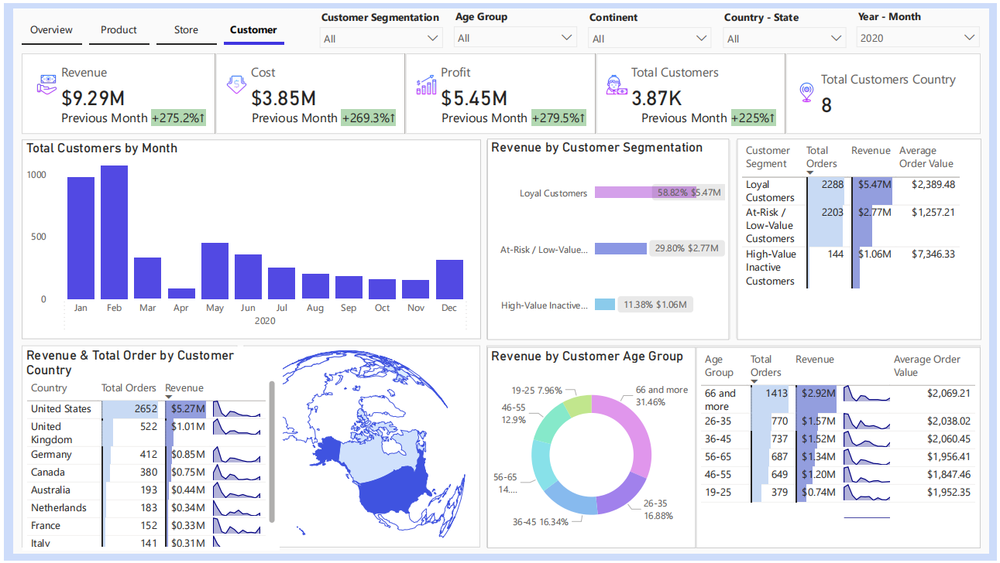

# 📊 Global Electronics Retailer Data Analyst Project

Welcome to the Global Electronics Retailer analytics and machine learning project. This project focuses on gaining insights from retail data and applying ML models to solve real-world business problems in the electronics retail industry.

---

## 📃 Table of Contents

- 🔍 Overview  
- 🎯 Objective  
- 🚀 Getting Started - Data Analysis  
  - 📦 Importing Necessary Libraries  
  - 📂 Loading Data  
  - 🔧 Data Cleaning  
  - 📈 Exploratory Data Analysis (EDA)  
- 🤖 Machine Learning  
  - 📦 Importing Necessary Libraries  
  - Customer Segmentation Model
  - Churn Prediction Model
  - Recommendation Systems Model  
  - Sales Forecasting Model
- 📈 Visualization  
- 🛠️ Technology Used  
- ✅ Conclusion  
- 📬 Contact  

---

## 🔍 Overview

The Global Electronics Retailer dataset contains transactional, customer, product, and store-level data from various countries. It enables comprehensive data analysis and machine learning applications in retail, helping stakeholders make data-driven decisions.

---

## 🎯 Objective

The primary objectives of this project are:

- Visualize insights for strategic decision-making.
- Understand customer behavior and purchasing patterns.
- Build Machine Learning Model:
  - Segment customers for targeted marketing.
  - Predict potential customer churn.
  - Build a recommendation engine.
  - Forecast future sales trends.

---

## 🚀 Getting Started - Data Analysis

### 📦 Importing Necessary Libraries

Python libraries used:

- `pandas`, `numpy` for data handling  
- `matplotlib`, `seaborn`, `plotly` for visualization  

### 📂 Loading Data

The dataset consists of multiple related tables covering orders, customers, products, stores, and exchange rates. Below is a description of each table and its key fields:

### 🧾 **Sales Table**

| Field         | Description                                            |
| ------------- | ------------------------------------------------------ |
| Order Number  | Unique ID for each order                               |
| Line Item     | Identifies individual products purchased in an order   |
| Order Date    | Date the order was placed                              |
| Delivery Date | Date the order was delivered                           |
| CustomerKey   | Unique key identifying which customer placed the order |
| StoreKey      | Unique key identifying which store processed the order |
| ProductKey    | Unique key identifying which product was purchased     |
| Quantity      | Number of items purchased                              |
| Currency Code | Currency used to process the order                     |

### 👥 **Customers Table**

| Field       | Description                       |
| ----------- | --------------------------------- |
| CustomerKey | Primary key to identify customers |
| Gender      | Customer gender                   |
| Name        | Customer full name                |
| City        | Customer city                     |
| State Code  | Customer state (abbreviated)      |
| State       | Customer state (full)             |
| Zip Code    | Customer zip code                 |
| Country     | Customer country                  |
| Continent   | Customer continent                |
| Birthday    | Customer date of birth            |

### 📦 **Products Table**

| Field          | Description                           |
| -------------- | ------------------------------------- |
| ProductKey     | Primary key to identify products      |
| Product Name   | Product name                          |
| Brand          | Product brand                         |
| Color          | Product color                         |
| Unit Cost USD  | Cost to produce the product (USD)     |
| Unit Price USD | Product list price (USD)              |
| SubcategoryKey | Key to identify product subcategories |
| Subcategory    | Product subcategory name              |
| CategoryKey    | Key to identify product categories    |
| Category       | Product category name                 |

### 🏪 **Stores Table**

| Field         | Description                      |
| ------------- | -------------------------------- |
| StoreKey      | Primary key to identify stores   |
| Country       | Store country                    |
| State         | Store state                      |
| Square Meters | Store footprint in square meters |
| Open Date     | Store open date                  |

### 💱 **Exchange Rates Table**

| Field    | Description                   |
| -------- | ----------------------------- |
| Date     | Date                          |
| Currency | Currency code                 |
| Exchange | Exchange rate compared to USD |

### 🔧 Data Preprocessing

[Data Preprocessing](Data_Preprocessing.ipynb)
- Removed nulls and duplicates  
- Standardized date formats  
- Handled inconsistent text encoding and special characters (e.g., French accents)
- Store all data into 1 file csv.

### 📈 Exploratory Data Analysis (EDA)

[Data Analysis](Data_Analysis.ipynb)
- Analyzed total sales by country, channel (online vs in-store), and product category  
- Tracked customer age distribution, order trends by month and year  
- Identified top-selling products and high-profit regions  

---

## 🔬Explore Dataset with SQL Server
- Load data into Database in SQL Server and query the important insight.
- Aggregate data by sales, products, stores, customer.
[All SQL query file into SQL data analysis folder](./SQL_data_analysis/)

---

## 🤖 Machine Learning

### 📦 Importing Necessary Libraries

Used `scikit-learn`, `KMeans`, `XGBoost`.

### Customer Segmentation Model

[Customer Segmentation](./machine_learning/Customer_Segmetation.ipynb)
- Features: Total Sales, Total Orders, Recency, Average Order Value, etc.  
- Method: KMeans clustering. 
- Result: Segmented into Loyal, At-Risk / Low-Value, and High-Value Inactive customers.  

### Churn Prediction (Updating...)

- Features: Recency, Frequency, Monetary Value (RFM), Demographics  
- Model: XGBoost Classifier  
- Evaluation: Accuracy, ROC-AUC

### Recommendation Systems (Updating...)

- Techniques: Collaborative Filtering, Content-Based Filtering  
- Goal: Recommend electronics products based on purchase history  

### Sales Forecasting (Updating...)

- Time Series Forecasting using `Prophet` or `ARIMA`  
- Predicted future sales volume by product and country  

---

## 📈 Visualization

Interactive dashboards built using:

- Plotly and Seaborn for Python-based visualizations.
- Power BI for business-level reports:
  -  Overview Dashboard:
    

  -  Product Dashboard:
    

  -  Store Dashboard:
    

-  Customer Dashboard:
    

---

## ✅ Conclusion

Dưới đây là phần ✅ **Conclusion** chi tiết hơn cho file `README.md` của bạn trong dự án **Global Electronics Retailer**:

---

## ✅ Conclusion

The **Global Electronics Retailer** project provides a comprehensive view of retail operations through in-depth data analysis and machine learning. By analyzing customer behavior, product performance, and sales trends across multiple countries and channels (Online vs In-Store), this project delivers actionable insights for strategic business decision-making.

Key outcomes include:

* **Enhanced Customer Understanding**: Using clustering techniques like K-Means, customers were segmented based on purchasing behavior, allowing the business to tailor marketing strategies, loyalty programs, and personalized recommendations.

* **Improved Retention and Targeting**: Through churn prediction models, the business can proactively identify at-risk customers and intervene with targeted retention campaigns, improving customer lifetime value.

* **Sales Insights**: Forecasting future sales based on historical patterns helps in planning inventory, optimizing supply chain operations, and setting realistic revenue goals.

* **Product Strategy Optimization**: Subcategory and product-level analysis revealed which items contribute most to revenue, helping prioritize investments and promotional efforts.

* **Global Market Overview**: With customers and stores across countries and continents, the insights into regional performance enable effective expansion planning and market-specific strategies.

* **Interactive Dashboards**: Visualizations in Power BI and Plotly support intuitive exploration of data by business users, helping decision-makers monitor KPIs in real time.

Overall, the project not only demonstrates technical proficiency in data engineering and machine learning but also showcases how data-driven insights can transform retail strategy and execution.

---

## 📞 Contact
For questions or suggestions, reach out via nguyenquangphuc412@gmail.com 

📅 Updated date: 12-05-2025

Thank you for visiting this project! ⭐

---